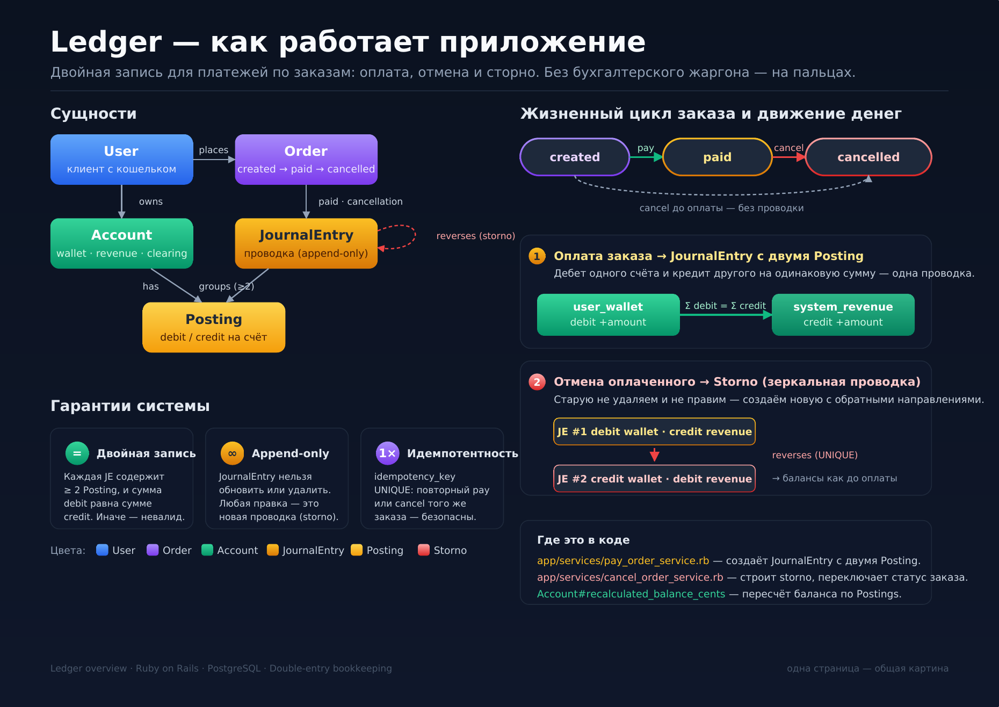

# test_ledger

Демонстрация двойной бухгалтерии на Rails 8 для домена Заказ / Юзер / Счёт.



Каждое движение денег — это бухгалтерская проводка с двумя сторонами (откуда → куда), сумма всегда сходится. Отмена платежа создаёт обратную запись (storno), а не правит оригинал.

## Что приложение умеет

- **Оплата заказа.** Заказ переходит из `created` в `paid`. Создаётся проводка: дебет на кошельке юзера, кредит на счёте выручки. Балансы пересчитываются.
- **Отмена оплаченного заказа (сторно).** Создаётся новая проводка с обратными постингами и ссылкой на оригинал. Балансы возвращаются. Оригинал не модифицируется.
- **Отмена неоплаченного заказа.** Меняется только статус, проводка не создаётся.

Все операции идемпотентны: повторный вызов с тем же входом не приведёт к двойному списанию или двойному сторно.

## Запустить

Нужны Ruby 3.3.7 и PostgreSQL 14+.

```bash
bundle install
bin/rails db:setup
bundle exec rspec
```

`db:setup` создаёт базу, загружает схему и заполняет три демо-сценария.

## Сценарии в коде

Три сценария собраны в [`db/seeds.rb`](db/seeds.rb):

```ruby
# Сценарий 1: оплата
sasha_order = Order.create!(user: sasha, amount_cents: 1_500)
PayOrderService.call(order: sasha_order)

# Сценарий 2: оплата + отмена со сторно
maxim_order = Order.create!(user: maxim, amount_cents: 5_000)
PayOrderService.call(order: maxim_order)
CancelOrderService.call(order: maxim_order)

# Сценарий 3: отмена до оплаты
viktoria_order = Order.create!(user: viktoria, amount_cents: 2_000)
CancelOrderService.call(order: viktoria_order)
```

После `db:setup` файл уже отработал, данные в базе — можно посмотреть через `bin/rails console`.

## Сущности

- **JournalEntry** — одно бизнес-событие (оплата или отмена). Дата, ссылка на источник, ключ идемпотентности.
- **Posting** — одна сторона проводки (`debit` / `credit` на счёте, сумма всегда положительная).
- **Account** — счёт. Принадлежит юзеру (кошелёк) или системный (выручка, клиринг).
- **Order** — бизнес-объект со статусами `created → paid → cancelled`.

## Пример проводки

Юзер платит за заказ 15.00:

```
JournalEntry #1   idempotency_key=order:1:pay
  Posting: User.wallet     DR 1500
  Posting: System.revenue  CR 1500
            Σ Дт = Σ Кт = 1500
```

Заказ отменяют — создаётся сторно:

```
JournalEntry #2   idempotency_key=order:1:cancel   reverses=#1
  Posting: User.wallet     CR 1500
  Posting: System.revenue  DR 1500
```

Балансы возвращаются в 0. Запись #1 не тронута.

## Ключевые свойства

- **Append-only журнал.** JournalEntry и Posting запрещают `update` и `destroy` через `before_update` / `before_destroy`. Прошлое не правится.
- **Валидация ∑Дт = ∑Кт.** JournalEntry проверяет суммы постингов перед сохранением. Перекошенная проводка не сохраняется.
- **Идемпотентность через БД.** `idempotency_key` с UNIQUE индексом — Postgres сам отбивает дубль, защита не на уровне Ruby.
- **Защита от двойного сторно.** `reverses_journal_entry_id` тоже UNIQUE — одну проводку нельзя сторнировать дважды.
- **Сериализация конкурентных операций.** `wallet.with_lock` (`SELECT FOR UPDATE`) защищает от race condition. Тест с двумя потоками проверяет.
- **State machine — своя, без гема.** Три статуса, четыре перехода.
- **Деньги — `bigint` в центах.** Без `Float`, без Money gem.

## Стек

- Ruby 3.3.7
- Rails 8.0
- PostgreSQL 14+
- RSpec + factory_bot + shoulda-matchers
- annotaterb (схема таблиц встроена в model / spec / factory файлы)

83 теста: модели, сервисы, edge cases (идемпотентность, нелегитимные переходы, защита от двойного сторно), concurrency-тест с двумя потоками.
